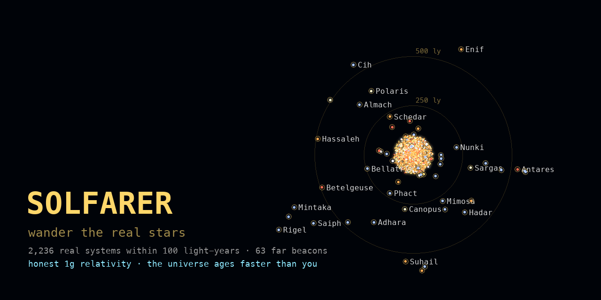

# Solfarer

**Wander the real stars.** → **[thejambi.github.io/Solfarer](https://thejambi.github.io/Solfarer/)**



Every point of light is a real star system — 2,236 of them within 100
light-years of Sol, from the HYG catalog, drawn in their true spectral
colors. Click any star for its card, hit **SET COURSE**, and go. Travel
is honest special relativity: a 1g burn to the midpoint, flip, brake.
The universe ages faster than you do — that's not a game mechanic, it's
the twin paradox — and your log keeps the lifetime score.

Not a game. Just the experience.

## What's here

- **The Local Bubble, complete.** Every HYG system within 100 ly:
  named stars, red dwarfs, white dwarfs, all of it. This is the volume
  where the catalog is honest, so the map is too.
- **Search that dims the sky.** The magnifier opens free-text search
  (partial matches across name, constellation, class) plus filters:
  spectral class chips, constellation, named-only. Everything that
  doesn't match falls into shadow — and out of reach of the pointer.
  Try `sirius`, or light up class **B** and count six.
- **The far beacons.** 63 famous stars beyond the bubble — every
  proper-named star brighter than magnitude 2.7: Betelgeuse, Rigel,
  Polaris, Deneb, Antares, Canopus, Orion's whole belt. Zoom out and
  everything reachable in a human lifetime shrinks to one golden huddle
  while the beacons hang in the void, rings marking 250/500/1000/2000 ly.
  They're real destinations. Check what the trip costs.
- **3D orbit.** Toggle **3D** and drag to turn the sky around wherever
  you're docked. The range rings lean over with the view, near stars
  swell, far ones shrink, and the beacons drop guide-lines to the
  galactic plane so you can see who floats above it and who hangs
  below. Search and filters work here too — light up a constellation
  and watch it hold together in depth.
- **Star cards with the real numbers.** Class and nature (luminosity
  class parsed from the spectral type, so Betelgeuse is a red
  supergiant, Pollux an orange giant), distance, luminosity in Suns,
  whether you can see it from Earth with your naked eye, variability —
  and the fare: universe years, your years, peak velocity and gamma.
- **The flight.** Optional, and worth it: relativistic aberration,
  Doppler shift, beaming, and at high gamma the cosmic microwave
  background itself glowing ahead of you — real optics over the real
  star field, riding the Lighthaul engine. **AUTO TRAVEL** skips it.
- **A lifetime ledger.** Journeys, light-years, how much you've aged,
  how much the universe has, farthest from home. Persisted locally.
  Sol → Betelgeuse: you age 12.1 years. Everyone you left ages 499.9.

## The physics

Constant 1g proper acceleration, closed form in rapidity: for one-way
distance *d* (ly, c=1, a=1.032 c/yr), γ<sub>peak</sub> = ad/2 + 1,
φ = arcosh(γ), ship time 2φ/a, universe time 2·sinh(φ)/a, peak β =
tanh(φ). The flight animation maps proper time linearly, which is why
the clocks in the HUD run honest — rapidity is linear in proper time
under constant acceleration.

## The data

[HYG v4.1](https://github.com/astronexus/HYG-Database) (Hipparcos +
Yale + Gliese), equatorial → galactic coordinates, one entry per
system (brightest component), deduplicated. The bubble keeps everything
within 100 ly; the beacons are openly a curated famous-stars layer,
because past ~100 ly Hipparcos only saw the bright minority — an
"expanded" map would be a hollow shell of giants pretending to be a
neighborhood.

`tools/make_stars_js.py` regenerates `src/stars.js` from the HYG CSV
(fetches it on first run). `tools/make_preview.py` re-renders the
social preview from the same data.

## Running it

Static site, no build step, no dependencies beyond a browser
(three.js arrives via CDN import map):

```bash
python3 -m http.server 8000
```

Installs as a PWA and works offline after first load.

## Lineage

The full circle: [Lighthaul](https://github.com/thejambi/Lighthaul)
(web game) → Lighthaul (Pebble game) →
[Lighthaul Watchface](https://github.com/thejambi/Lighthaul-Watchface) →
[Solfarer](https://github.com/thejambi/Solfarer-Watchface) (Pebble
watchface) → Solfarer Atlas (Pebble app) → back to the web.
`src/relativity.js` — the relativistic star shaders — is shared with
the Lighthaul web game.

MIT licensed.
